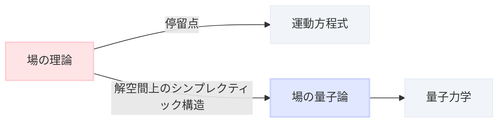

# まず、この記事の流れ

もっとたくさんの矢印があるとは思うけど、今回の流れはこんな感じ

# ばねの運動と場の理論

ばねの運動はニュートンの運動方程式

$$
\ddot{\varphi}(t) = -k\varphi(t)
$$

で表される。$\varphi(t)$ は時間 $t$ でのばねの変位を表している

これを場を使って定式化する。場全体を $\mathcal{F} \coloneqq \{ \varphi(t): \mathbb{R} \to \mathbb{R} \}$ とする。ラグランジアン $L: \mathcal{F} \times \mathbb{R} \to \mathbb{R}$ を

$$
L(\varphi, t) \coloneqq \frac{1}{2}\dot{\varphi}(t)^2 - \frac{k}{2}\varphi(t)^2
$$

で定義し、作用と呼ばれる $S: \mathcal{F} \to \mathbb{R}$ を

$$
S(\varphi) \coloneqq \int_{-\infty}^\infty L(\varphi, t) \, dt
$$

で定める

作用の停留点を求める。まず、$L$ の $(\varphi_0, t)$ での $\mathcal{F}$ 方向の微分 $\delta L_{(\varphi_0, t)}$ を考える

$$
\begin{aligned}
  \delta L_{(\varphi_0, t)}(\xi) &\coloneqq \lim_{\varepsilon \to 0} \frac{L(\varphi_0 + \varepsilon\xi, t) - L(\varphi_0, t)}{\varepsilon} \\
  &= \lim_{\varepsilon \to 0} \left\{ \frac{1}{2\varepsilon}[(\dot{\varphi_0}(t) + \varepsilon\dot{\xi}(t))^2 - \dot{\varphi_0}(t)^2] - \frac{k}{2\varepsilon}[(\varphi_0(t) + \varepsilon\xi(t))^2 - \varphi_0(t)^2] \right\} \\
  &= \dot{\varphi_0}(t)\dot{\xi}(t) - k\varphi_0(t)\xi(t)
\end{aligned}
$$

作用 $S(\varphi) \coloneqq \int_{-\infty}^\infty L(\varphi, t) \, dt$ の微分は

$$
\begin{aligned}
  \delta S_{\varphi_0}(\xi) &= \int_{-\infty}^\infty \delta L_{(\varphi_0, t)}(\xi) \, dt \\
  &= \int_{-\infty}^\infty (\dot{\varphi_0}(t)\dot{\xi}(t) - k\varphi_0(t)\xi(t)) \, dt \\
  &= \int_{-\infty}^\infty (-\ddot{\varphi_0}(t) - k\varphi_0(t))\xi(t) \, dt
\end{aligned}
$$

$\delta S_{\varphi_0} = 0 \Leftrightarrow \ddot{\varphi_0}(t) = -k\varphi_0(t)$ であり、作用 $S$ の停留点として運動方程式が復元された

# $1 + 0$ 次元のクライン-ゴルドン場

場全体を $\mathbb{C}$ 値に変更して $\mathcal{F} \coloneqq \{ \varphi(t): \mathbb{R} \to \mathbb{C} \}$ とする。ラグランジアン $L: \mathcal{F} \times \mathbb{R} \to \mathbb{R}$ を

$$
L(\varphi, t) \coloneqq |\dot{\varphi}(t)|^2 - m^2|\varphi(t)|^2 = \dot{\varphi}(t)\bar{\dot{\varphi}}(t) - m^2\varphi(t)\bar{\varphi}(t)
$$

で定義する。物理的には $m$ は粒子の質量に対応する。運動方程式の計算を、今回は無限次元多様体を全面に出して行なってみる。$\varphi \in \mathcal{F}$ に対して、$\varphi$ からの変化の方向 $T_\varphi\mathcal{F}$ は $T_\varphi\mathcal{F} \coloneqq \{ \xi: \mathbb{R} \to \mathbb{C} \}$ と思える。一般に、関数 $F: \mathcal{F} \to \mathbb{C}$ に対して、$\delta F \in \Omega^1(\mathcal{F})$ を

$$
\delta F_{\varphi}(\xi) \coloneqq \lim_{\varepsilon \to 0} \frac{F(\varphi + \varepsilon\xi) - F(\varphi)}{\varepsilon}
$$

と定義する。作用 $S(\varphi) \coloneqq \int L(\varphi, t) \, dt$ の微分は

$$
\begin{aligned}
  \delta S &= \int \delta L \, dt \\
  &= \int (\dot{\varphi}\delta(\bar{\dot{\varphi}}) + \bar{\dot{\varphi}}\delta(\dot{\varphi}) - m^2\varphi\delta\bar{\varphi} - m^2\bar{\varphi}\delta\varphi) \, dt \\
  &= \int (\dot{\varphi}\frac{d}{dt}(\delta\bar{\varphi}) + \bar{\dot{\varphi}}\frac{d}{dt}(\delta\varphi) - m^2\varphi\delta\bar{\varphi} - m^2\bar{\varphi}\delta\varphi) \, dt \\
  &= -\int [(\ddot{\varphi} + m^2\varphi)\delta\bar{\varphi} + \overline{(\ddot{\varphi} + m^2\varphi)}\delta\varphi] \, dt
\end{aligned}
$$

よって、$S$ の停留点は

$$
\delta S_{\varphi} = 0 \Leftrightarrow \ddot{\varphi} + m^2\varphi = 0
$$

であり、右辺は ($1 + 0$ 次元の) クライン-ゴルドン方程式と呼ばれる

# 解空間とその上のシンプレクティック形式

ここからは構造を見やすくするため、$m = 1$ とする

場の量子論を構成する準備として、解空間とその上のシンプレクティック形式を構成する

$$
\mathrm{Sol} \coloneqq \{ \varphi \in \mathcal{F} \mid \ddot{\varphi} + \varphi = 0 \} = \{ pe^{it} + qe^{-it} \mid p, q \in \mathbb{C} \} \subset \mathcal{F}
$$

を運動方程式の解空間とする

解空間上のシンプレクティック形式を構成するために、部分積分で消えた境界項をきちんと計算する。$\delta S = \int \delta L \, dt$ の中身を微分形式を使って計算する

$$
\begin{aligned}
  \delta L \wedge dt &= [\dot{\varphi}\frac{d}{dt}(\delta\bar{\varphi}) + \bar{\dot{\varphi}}\frac{d}{dt}(\delta\varphi) - \varphi\delta\bar{\varphi} - \bar{\varphi}\delta\varphi] \wedge dt \\
  &= -(\ddot{\varphi} + \varphi)\delta\bar{\varphi} \wedge dt - \overline{(\ddot{\varphi} + \varphi)}\delta\varphi \wedge dt - d_t(\dot{\varphi}\delta\bar{\varphi} + \bar{\dot{\varphi}}\delta\varphi)
\end{aligned}
$$

最右辺の第 2 項から $d_t$ を外したものを

$$
\gamma \coloneqq -\dot{\varphi}\delta\bar{\varphi} - \bar{\dot{\varphi}}\delta\varphi \in \Omega^{1, 0}(\mathcal{F} \times \mathbb{R})
$$

とおく。$\gamma$ をさらに $\mathrm{Sol}$ 方向に微分すると

$$
\omega \coloneqq \delta\gamma = -\delta{\dot{\varphi}} \wedge \delta\bar{\varphi} - \delta{\bar{\dot{\varphi}}} \wedge \delta\varphi \in \Omega^{2, 0}(\mathcal{F} \times \mathbb{R})
$$

$\omega$ は幾何的には曲率を計算していると解釈できるが、ここでは立ち入らない。$\omega$ を $\mathrm{Sol} \times \mathbb{R}$ 上に制限する。$\varphi = pe^{it} + qe^{-it}$ を代入して

$$
\begin{aligned}
  \omega|_{\mathrm{Sol} \times \mathbb{R}} &= -i(e^{it}dp - e^{-it}dq) \wedge (e^{-it}d\bar{p} + e^{it}d\bar{q}) + i(e^{-it}d\bar{p} - e^{it}d\bar{q}) \wedge (e^{it}dp + e^{-it}dq) \\
  &= -2i(dp \wedge d\bar{p} - dq \wedge d\bar{q})
\end{aligned}
$$

これは点に依らないので、$\omega_\mathrm{Sol} \coloneqq -2i(dp \wedge d\bar{p} - dq \wedge d\bar{q}): \mathrm{Sol} \times \mathrm{Sol} \to \mathbb{C}$ ができた

# 場の理論から場の量子論へ

場の量子論の厳密な定義は省略するが、場の量子論はヒルベルト空間 $\mathcal{H}$ と場の演算子と呼ばれる $\Phi: \mathbb{R} \to \mathcal{End}(\mathcal{H})$ から構成される。以降はこの $\mathcal{H}$ と $\Phi$ を構成する

解空間のうち、正エネルギー部分を取り $H_+ \coloneqq \{ pe^{it} \mid p \in \mathbb{C} \} \subset \mathrm{Sol}$ とする。$\omega_\mathrm{Sol}$ から $H_+$ 上の内積が誘導される

$$
(p_1 e^{it}, p_2 e^{it}) \coloneqq \frac{i}{2}\omega_\mathrm{Sol}(p_1 e^{it}, \overline{p_2 e^{it}}) = p_1\bar{p_2}
$$

特に $(e^{it}, e^{it}) = 1$ は後の計算でも使う

フォック空間 $\mathcal{D} \coloneqq \bigoplus_{n = 0}^\infty S^n H_+$ を考える。具体的には、多項式環を使って

$$
\mathcal{D} = \mathbb{C}[e^{it}] = \mathrm{span}_{\mathbb{C}}\{ e^{ikt} \mid k \in \mathbb{Z}_{\ge 0} \}
$$

と表わせる。$\mathcal{D}$ には、全ての組み合わせでペアリングを考えるような内積

$$
(e^{ikt}, e^{ilt}) = (\underbrace{e^{it} \cdots e^{it}}_k, \underbrace{e^{it} \cdots e^{it}}_l) \coloneqq \begin{cases}
  k! &\quad (k = l) \\
  0 &\quad (k \ne l)
\end{cases}
$$

が入る。完備化して $\mathcal{H} \coloneqq \widehat{\mathcal{D}}$ と定義する。最後に場の演算子 $\Phi: \mathbb{R} \to \mathrm{End}(\mathcal{D})$ を定義する

$$
\Phi(s) \coloneqq \varepsilon_{e^{i(s + t)}} + \iota_{(-, e^{i(s + t)})} = e^{is}\varepsilon_{e^{it}} + e^{-is}\iota_{(-, e^{it})}
$$

ただし

$$
\begin{aligned}
  \varepsilon_{e^{it}} e^{ikt} &\coloneqq e^{it} \cdot e^{ikt} = e^{i(k + 1)t} \\
  \iota_{(-, e^{it})} e^{ikt} &= \iota_{(-, e^{it})} (\underbrace{e^{it} \cdots e^{it}}_k) \coloneqq k e^{i(k - 1)t}
\end{aligned}
$$

であり、それぞれ生成演算子 $\varepsilon \coloneqq \varepsilon_{e^{it}}$、消滅演算子 $\iota \coloneqq \iota_{(-, e^{it})}$ と呼ばれる。$\varepsilon$ と $\iota$ は $\mathcal{D}$ の内積に関して互いに共役作用素であり、$\Phi(s)$ は自己共役になる

# 実は先ほど構成した場の量子論は量子力学です

$1 + 0$ 次元で空間がなかったので、実は先ほど構成した場の量子論は量子力学です。しかし、同じ構成を空間ありでも実行することができ、真の場の量子論ができます。この記事では、先ほど構成した $1 + 0$ 次元の場の量子論が、古典的な量子力学と一致することを見て終わりたいと思います

ハミルトニアンを $H \coloneqq \varepsilon\iota$ で定義すると

$$
H e^{ikt} = \varepsilon\iota e^{ikt} = k e^{ikt}
$$

であり、$H$ は固有値として $e^{ikt}$ の振動数つまりエネルギーを取り出すことがわかる。また

$$
\begin{aligned}
  e^{isH}\Phi(0)e^{-isH}e^{ikt} &= e^{isH}(\varepsilon + \iota)e^{-isH}e^{ikt} \\
  &= e^{-isk}e^{isH}(\varepsilon + \iota)e^{ikt} \\
  &= e^{-isk}e^{isH}(e^{i(k + 1)t} + ke^{i(k - 1)t}) \\
  &= e^{is}e^{i(k + 1)t} + ke^{-is}e^{i(k - 1)t} \\
  &= (e^{is}\varepsilon + e^{-is}\iota)e^{ikt} \\
  &= \Phi(s)e^{ikt}
\end{aligned}
$$

だから、$\Phi(s) = e^{isH}\Phi(0)e^{-isH}$ は $\Phi(0)$ の $H$ による時間発展を記述していたことがわかる。$\Phi(0)$ 自体は位置演算子と呼ばれ、$\Phi(0) = \varepsilon + \iota$ は真空 $1 \in \mathcal{D} = \mathbb{C}[e^{it}]$ に繰り返し作用することで、$\mathcal{D}$ 全体を生成している

# 参考文献

- P. Deligne, P. Etingof, D. S. Freed, L. C. Jeffrey, D. Kazhdan, J. W. Morgan, D. R. Morrison, and E. Witten (eds.), _Quantum Fields and Strings: A Course for Mathematicians, Vol. 1_, American Mathematical Society, 1999.
