# 最近 QFT (場の量子論) に少し入門したので話してみたい

@dokadokaas

---

## 自己紹介

- **@dokadokaas**
- 興味は 数理物理 / 表現論 / 作用素環 / 確率論、最近は場の量子論を勉強中
- わかんなすぎること: 整数論 / 代数幾何

---

## この発表の流れ

もっとたくさんの矢印があるとは思うけど、今回の流れはこんな感じ

---

## ばねの運動 → 場の理論

ばねの運動は**ニュートンの運動方程式** $\ddot{\varphi}(t) = -k\varphi(t)$ で表される。これを「場」の言葉で書き直したい。

- **場全体**: $\mathcal{F} \coloneqq \{ \varphi: \mathbb{R} \to \mathbb{R} \}$
- **ラグランジアン** $L: \mathcal{F} \times \mathbb{R} \to \mathbb{R}$、**作用** $S: \mathcal{F} \to \mathbb{R}$ を

$$
L(\varphi, t) \coloneqq \tfrac{1}{2}\dot{\varphi}(t)^2 - \tfrac{k}{2}\varphi(t)^2, \qquad S(\varphi) \coloneqq \int_{-\infty}^\infty L(\varphi, t) \, dt
$$

で定義する

**一旦の目標**: 作用 $S$ の **停留点** として運動方程式を取り戻す

---

## 停留点 = 運動方程式

停留点条件は $\delta S = 0$。 $S = \int L\, dt$ なので $\delta S = \int \delta L \, dt$、まず $\delta L$ を計算する：

$$
\delta L_{(\varphi_0, t)}(\xi)
  \coloneqq \lim_{\varepsilon \to 0} \frac{L(\varphi_0 + \varepsilon\xi, t) - L(\varphi_0, t)}{\varepsilon}
  = \dot{\varphi_0}\dot{\xi} - k\varphi_0 \xi
$$

積分して **部分積分**：

$$
\delta S_{\varphi_0}(\xi)
  = \int (\dot{\varphi_0}\dot{\xi} - k\varphi_0 \xi) \, dt
  = \int (-\ddot{\varphi_0} - k\varphi_0)\xi \, dt
$$

任意の $\xi$ で $\delta S = 0 \ \Longleftrightarrow \ \ddot{\varphi_0} = -k\varphi_0$ ← **運動方程式が復元** ✅

---

## $1 + 0$ 次元のクライン-ゴルドン場

場を $\mathbb{C}$ 値に拡張：$\mathcal{F} \coloneqq \{ \varphi: \mathbb{R} \to \mathbb{C} \}$、ラグランジアンは

$$
L(\varphi, t) \coloneqq |\dot{\varphi}|^2 - m^2|\varphi|^2
$$

物理的には $m$ は粒子の質量。同じ要領で変分を取ると

$$
\delta S = 0 \ \Longleftrightarrow \ \ddot{\varphi} + m^2\varphi = 0
$$

これが **クライン-ゴルドン方程式**。以降は $m = 1$ とする

---

## 解空間とシンプレクティック形式

**解空間**：

$$
\mathrm{Sol} \coloneqq \{ pe^{it} + qe^{-it} \mid p, q \in \mathbb{C} \}
$$

部分積分で捨てた **境界項** を $\gamma$ にまとめ、外微分して $\omega$ を作る：

$$
\gamma \coloneqq -\dot{\varphi}\delta\bar{\varphi} - \bar{\dot{\varphi}}\delta\varphi, \quad
\omega \coloneqq \delta\gamma
$$

$\varphi = pe^{it} + qe^{-it}$ を代入して計算（略）すると、

$$
\omega_\mathrm{Sol} \coloneqq -2i(dp \wedge d\bar{p} - dq \wedge d\bar{q})
$$

← $\mathrm{Sol}$ 上の **シンプレクティック形式** 🎉

---

## 場の量子論 = ヒルベルト空間 + 場の演算子

ゴール：**ヒルベルト空間** $\mathcal{H}$ と **場の演算子** $\Phi: \mathbb{R} \to \mathrm{End}(\mathcal{H})$ を構成する

まず $\mathrm{Sol}$ の **正エネルギー部分** を取る：

$$
H_+ \coloneqq \{ pe^{it} \mid p \in \mathbb{C} \} \subset \mathrm{Sol}
$$

シンプレクティック形式 $\omega_\mathrm{Sol}$ から $H_+$ 上の **内積** が誘導される：

$$
(p_1 e^{it}, p_2 e^{it}) \coloneqq \tfrac{i}{2}\omega_\mathrm{Sol}(p_1 e^{it}, \overline{p_2 e^{it}}) = p_1\bar{p_2}
$$

特に $(e^{it}, e^{it}) = 1$

---

## フォック空間

対称テンソル積で **フォック空間** を作ると、 **多項式環** として実現される：

$$
\mathcal{D} \coloneqq \bigoplus_{n = 0}^\infty S^n H_+ = \mathbb{C}[e^{it}] = \mathrm{span}_{\mathbb{C}}\{ e^{ikt} \mid k \in \mathbb{Z}_{\ge 0} \}
$$

内積は「全組ペアリング」：

$$
(e^{ikt}, e^{ilt}) \coloneqq \begin{cases} k! & (k = l) \\ 0 & (k \ne l) \end{cases}
$$

ヒルベルト空間 $\mathcal{H} \coloneqq \widehat{\mathcal{D}}$（完備化）

---

## 場の演算子

残るは **場の演算子** $\Phi: \mathbb{R} \to \mathrm{End}(\mathcal{D})$。次のように定義する：

$$
\Phi(s) \coloneqq e^{is}\varepsilon + e^{-is}\iota
$$

**生成演算子** $\varepsilon$ と **消滅演算子** $\iota$ は

$$
\varepsilon\, e^{ikt} \coloneqq e^{i(k+1)t} \quad ({\color{#16a34a}\textbf{次数}\pmb{\uparrow}}), \qquad
\iota\, e^{ikt} \coloneqq k\, e^{i(k-1)t} \quad ({\color{#dc2626}\textbf{次数}\pmb{\downarrow}})
$$

$\varepsilon, \iota$ は内積に関して互いに共役 ⇒ $\Phi(s)$ は **自己共役**

---

## 実はこれは量子力学です

$1 + 0$ 次元で空間が無いので、これは量子力学。**ハミルトニアン** $H \coloneqq \varepsilon\iota$ とすると

$$
H\, e^{ikt} = k\, e^{ikt}
$$

固有値として **エネルギー** を取り出す。さらに計算すると

$$
\Phi(s) = e^{isH}\Phi(0)\, e^{-isH}
$$

← $\Phi(0)$ の **時間発展**

しかも $\Phi(0) = \varepsilon + \iota$ を真空 $1$ に繰り返し作用させると $\mathcal{D}$ 全体が生成される — つまり $\Phi(0)$ は **位置演算子** だった！

---

## まとめ

$$
\boxed{\text{作用 }S}
  \xrightarrow{\,\delta S = 0\,}
\boxed{\text{運動方程式}}
  \xrightarrow{\,\gamma,\ \omega\,}
\boxed{(\mathrm{Sol},\ \omega_\mathrm{Sol})}
  \xrightarrow{\,H_+,\ \mathbb{C}[e^{it}]\,}
\boxed{\mathcal{H},\ \Phi(s)}
$$

 

そして $1 + 0$ 次元では **量子力学** に一致し、$\Phi(0)$ は **位置演算子** だった！

参考文献: P. Deligne, P. Etingof, D. S. Freed, L. C. Jeffrey, D. Kazhdan, J. W. Morgan, D. R. Morrison, and E. Witten (eds.), _Quantum Fields and Strings: A Course for Mathematicians, Vol. 1_, AMS, 1999.

